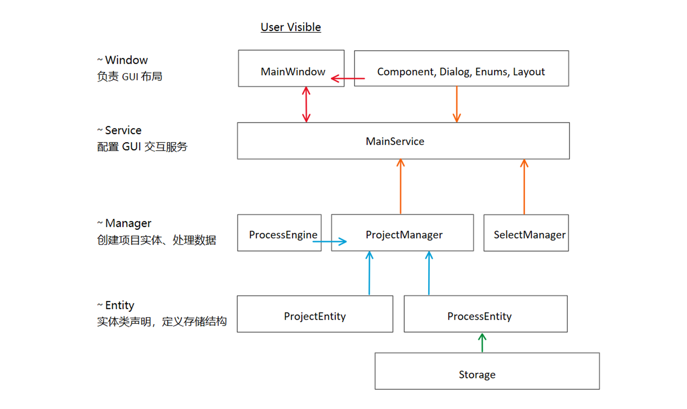
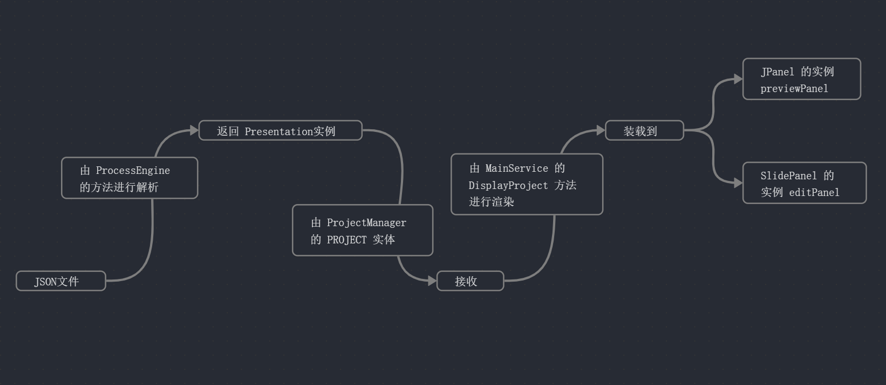

# PowerPoint_Java_Edition

> for java assignment
>
> 仅用于本人选修课大作业
>
> Author: Yizhe2022
>
> 2024/12/9

## 项目简介
PowerPoint_Java_Edition 是一个使用 Java 开发的简易演示文稿生成和编辑工具。
该项目旨在为选修课大作业提供一个示例应用，展示如何使用 Java 进行 GUI 开发和基本的文件操作。

## 功能特性
- 创建和编辑演示文稿
- 添加文本、图片和图形
- 保存和加载演示文稿文件

## 程序结构



## 工作流程



## 源码部署
### 前提条件
- 安装 Java 17 及以上
- 安装 Maven

### 安装
```shell
  git clone https://github.com/2022Yizhe/PowerPoint_Java_Edition.git
  cd PowerPoint_Java_Edition
  mvn clean install
```

### 运行
```shell
   cd target
   java -jar PowerPoint_Java_Edition-1.0-SNAPSHOT-jar-with-dependencies.jar
```

## 字节码执行
### 运行环境
- 安装 Java 17 及以上
### 检查 Java 运行时环境
```shell
  java -version
```
### 如果当前不是 Java 17
```shell
  set JAVA_HOME=C:\Program Files\Java\jdk-17  # 替换为你的 java-17 路径
  set PATH=%JAVA_HOME%\bin
```
### 执行字节码
```shell
  cd PATH\TO  # 替换为字节码文件路径
  java -jar PowerPoint_Java_Edition-1.0-SNAPSHOT-jar-with-dependencies.jar
```